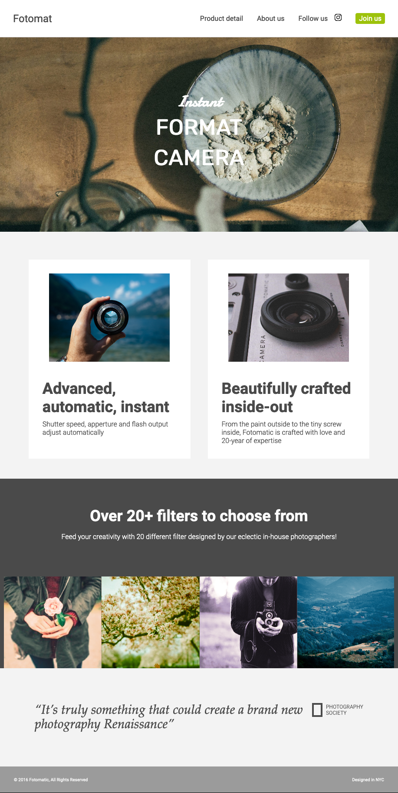

# Fotomatic

This is an advanced HTML/CSS CodeCademy project, done on my computer.
It's a website for a fictional camera shop.

## Description

The project's task was to fix the broken layout of a given website for three versions of the website: desktop, tablet and mobile. There was a redline that specified how the layouts should roughly look like.

This is how the given website looked like:

This is my solution for the three different layouts: 

### Desktop

### Tablet

### Mobile

## Built with

* Visual Studio Code
* HTML5
* CSS3 (responsive design)
* Markdown

## Run
Download the respository and open index.html in a browser. 

